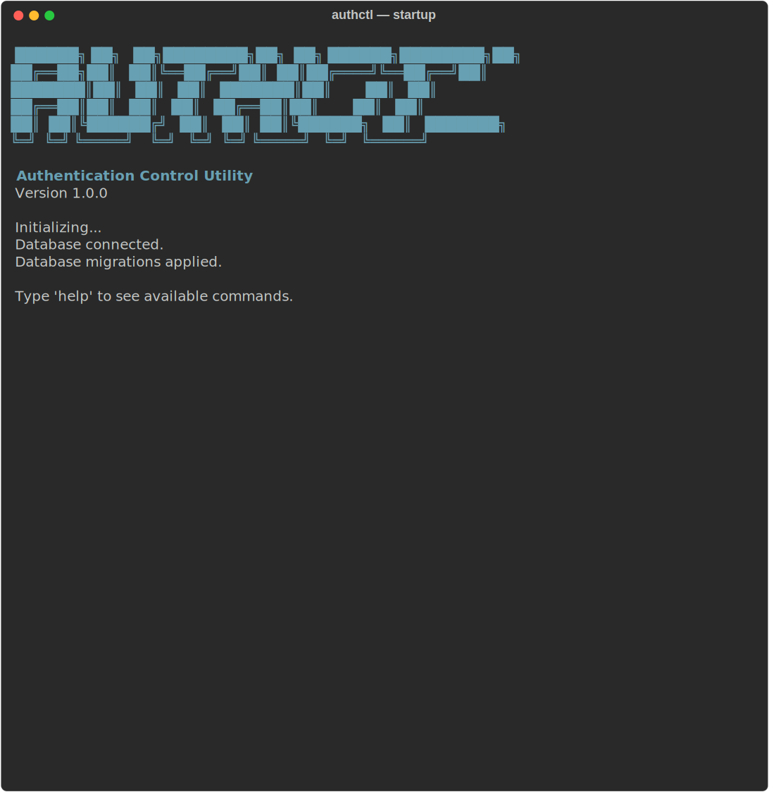
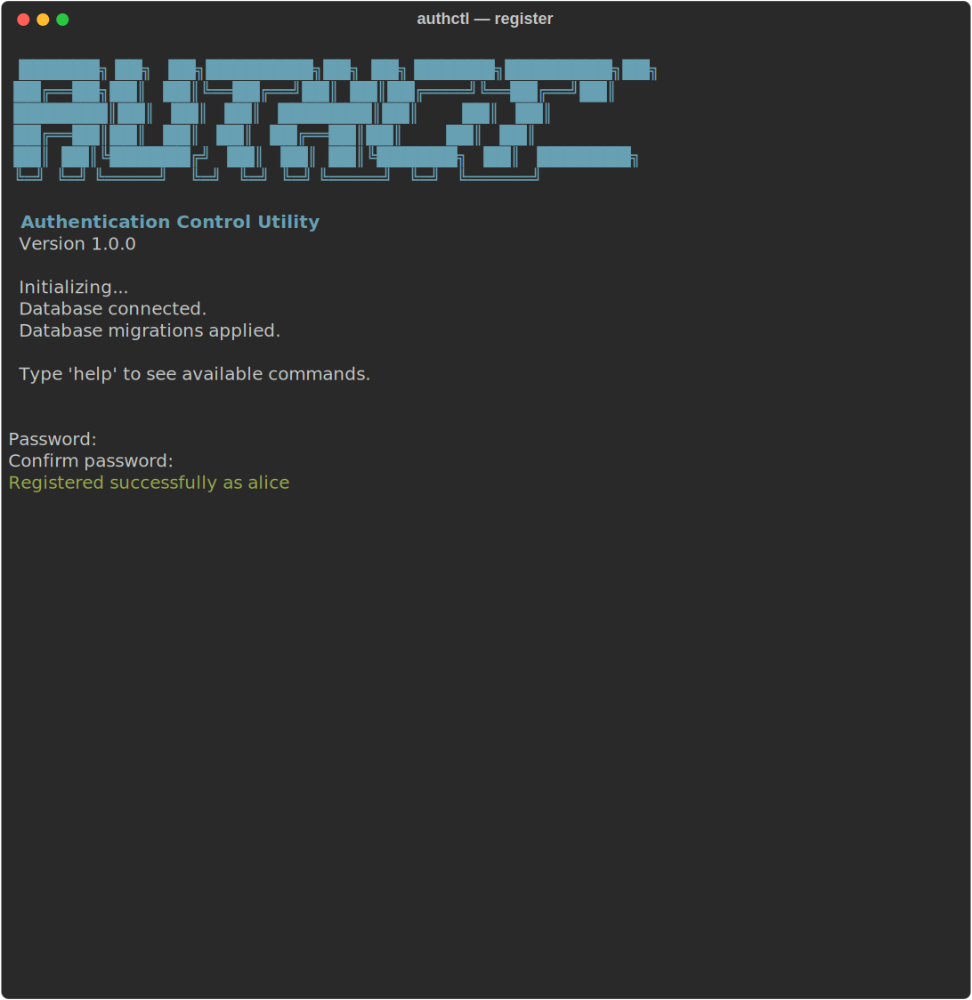
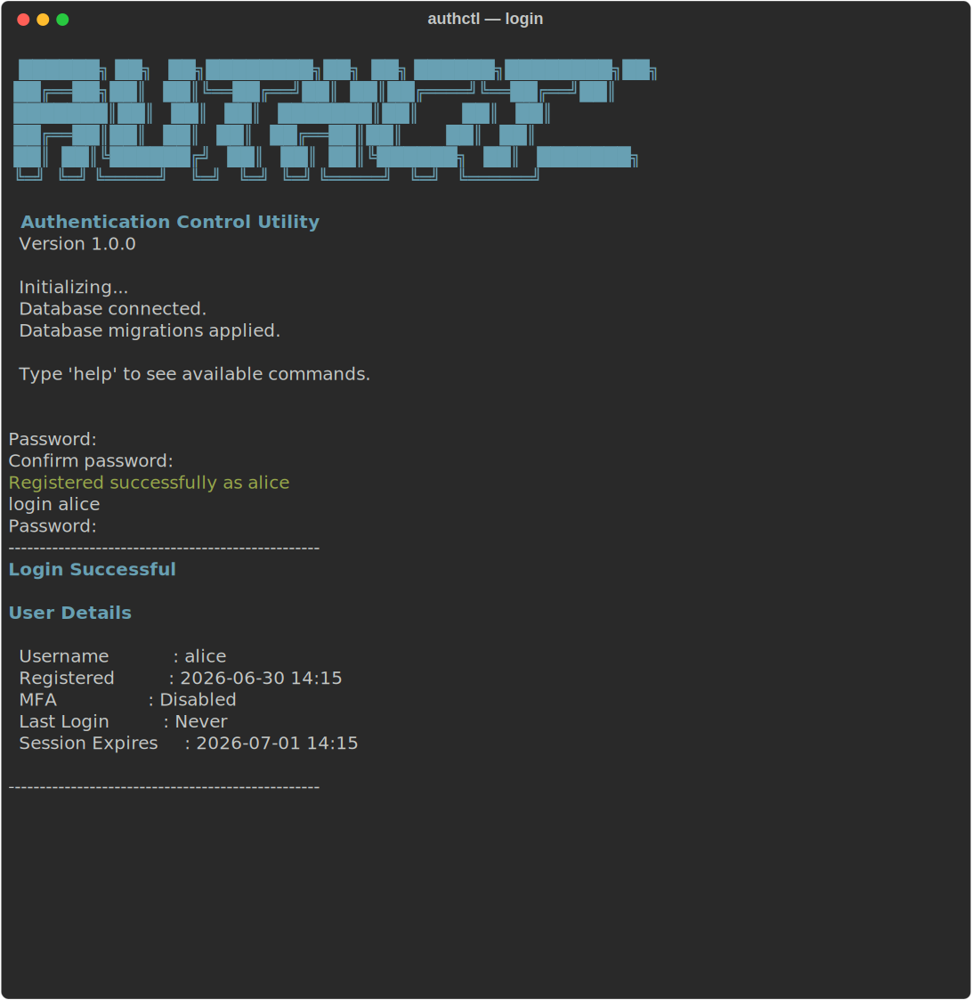
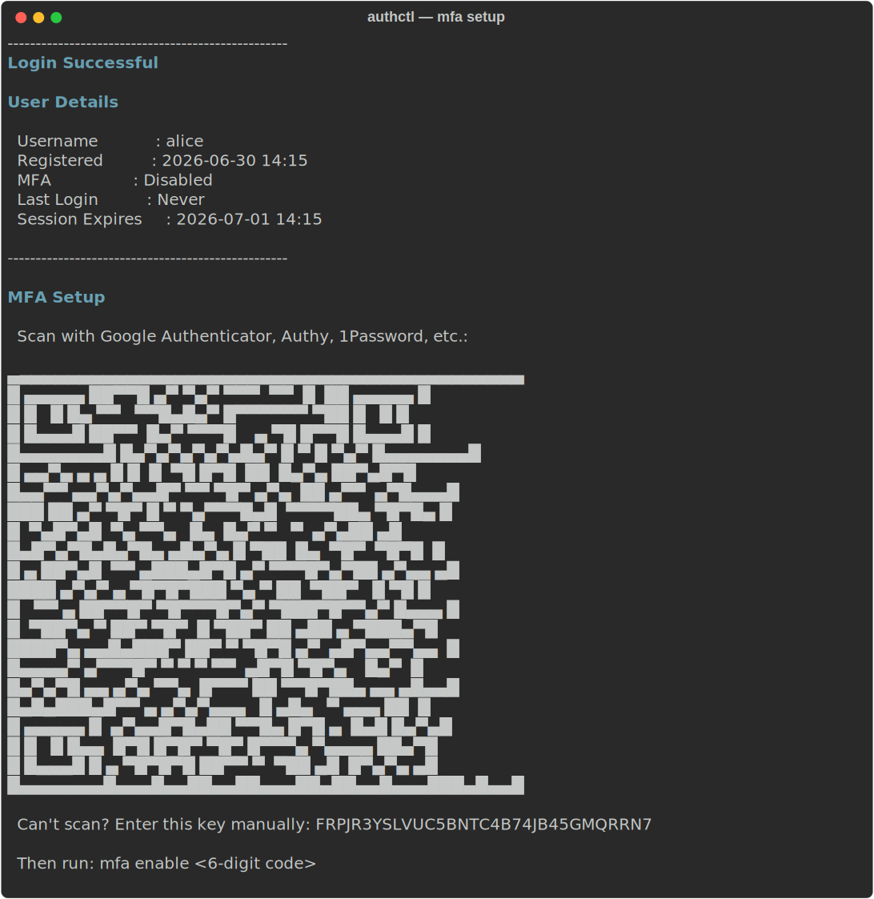
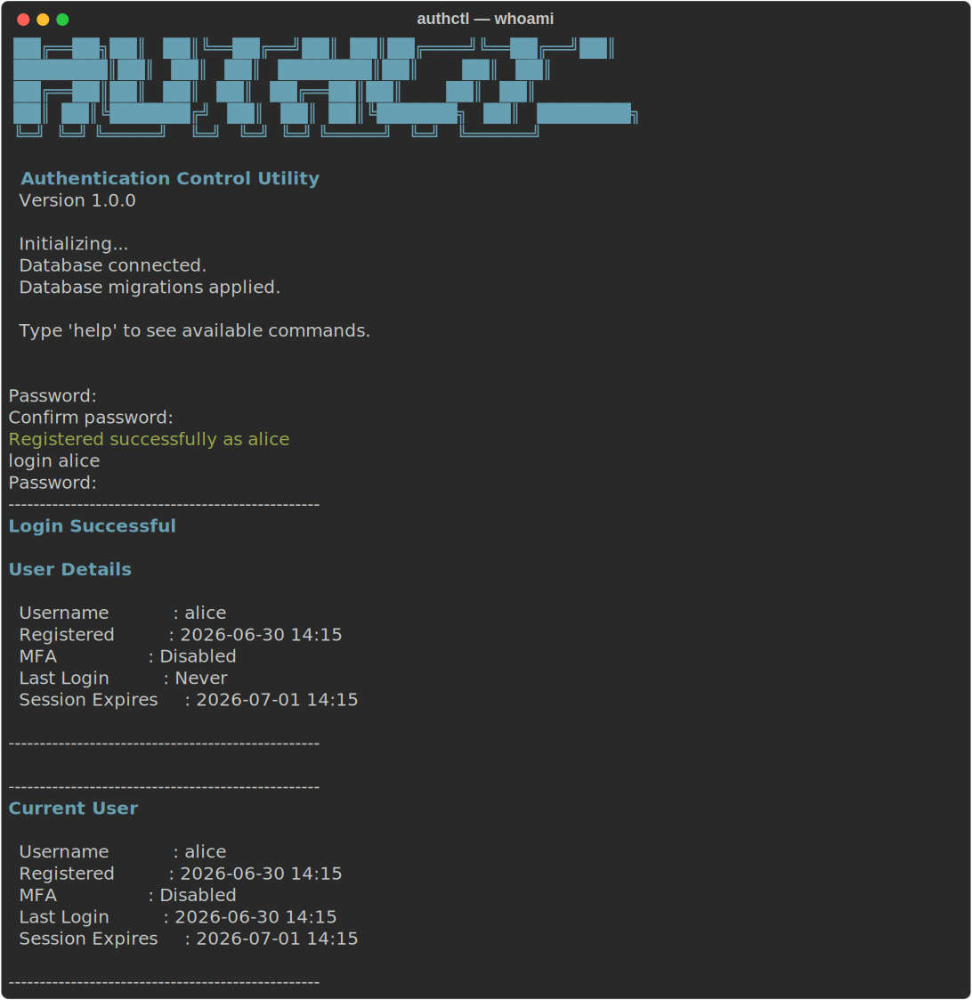

# authctl

```
  ██████╗ ██╗   ██╗████████╗██╗  ██╗ ██████╗████████╗██╗
 ██╔══██╗██║   ██║╚══██╔══╝██║  ██║██╔════╝╚══██╔══╝██║
 ███████║██║   ██║   ██║   ███████║██║        ██║   ██║
 ██╔══██║██║   ██║   ██║   ██╔══██║██║        ██║   ██║
 ██║  ██║╚██████╔╝   ██║   ██║  ██║╚██████╗   ██║   ███████╗
 ╚═╝  ╚═╝ ╚═════╝    ╚═╝   ╚═╝  ╚═╝ ╚═════╝   ╚═╝   ╚══════╝

  Authentication Control Utility
  Version 1.0.0
```

A containerised CLI authentication system with TOTP-based MFA. Built in Go with SQLite, bcrypt, and AES-256-GCM encryption. Security is the top priority in every design decision.

---

## Features

- Interactive readline shell with history and tab completion
- User registration with bcrypt password hashing (cost 12)
- Account lockout after configurable failed login attempts
- Session management with 32-byte cryptographically random tokens (SHA-256 hashed in DB)
- TOTP-based MFA (RFC 6238) with AES-256-GCM encrypted secrets at rest
- QR code rendered in the terminal during MFA setup — scan directly from your screen
- Audit and security event logging via `log/slog`
- Single binary, zero runtime dependencies beyond the SQLite file

---

## Setup

### Option 1: Docker (recommended)

**Prerequisites:** Docker and Docker Compose.

**1. Clone the repository**

```sh
git clone https://github.com/dakshcodez/authctl.git
cd authctl
```

**2. Create your `.env` file**

```sh
cp .env.example .env   # or create it from scratch — see Configuration below
```

Edit `.env` and set `TOTP_ENCRYPTION_KEY` to a freshly generated 32-byte key:

```sh
echo "TOTP_ENCRYPTION_KEY=$(openssl rand -hex 32)" >> .env
```

**3. Build the image**

```sh
docker compose build
```

**4. Run**

```sh
docker compose run --rm authctl
```

The SQLite database is stored in a named Docker volume (`authctl-data`) and persists between runs. To wipe everything and start fresh:

```sh
docker compose down -v
```

---

### Option 2: Local build

**Prerequisites:** Go 1.25+, `gcc` (Linux/macOS) or `mingw-w64` (Windows) for CGO — required by `mattn/go-sqlite3`.

**1. Clone the repository**

```sh
git clone https://github.com/dakshcodez/authctl.git
cd authctl
```

**2. Create your `.env` file**

```sh
cp .env.example .env
echo "TOTP_ENCRYPTION_KEY=$(openssl rand -hex 32)" >> .env
```

**3. Build**

```sh
go build -o authctl ./cmd/authctl
```

**4. Run**

```sh
./authctl
```

Or without building first:

```sh
go run ./cmd/authctl
```

---

## Screenshots

**Startup**



**Register**



**Login**



**MFA setup — QR code rendered directly in the terminal**



**Whoami**



---

## Commands

**Before login**

```
register [username]        Create a new account
login [username]           Log in (prompts for TOTP code when 2FA is enabled)
help                       Show available commands
exit                       Quit
```

**After login**

```
whoami                     Show current user and session details
enable-2fa                 Set up and enable TOTP-based 2FA (renders QR code)
disable-2fa                Disable 2FA (requires a valid TOTP code to confirm)
logout                     End the current session
clear                      Clear the screen
help                       Show available commands
```

**Advanced 2FA (step-by-step)**

```
mfa setup                  Generate a TOTP secret and render QR code
mfa enable <code>          Verify first code and activate 2FA
mfa disable <code>         Deactivate 2FA (requires a valid TOTP code)
```

---

## Configuration

All settings come from environment variables. Create a `.env` file in the project root — it is loaded automatically on startup and is gitignored.

| Variable              | Default                    | Description                                      |
|-----------------------|----------------------------|--------------------------------------------------|
| `APP_ENV`             | `development`              | `development` or `production`                    |
| `LOG_LEVEL`           | `info`                     | `debug`, `info`, `warn`, `error`                 |
| `DB_PATH`             | `./data/authctl.db`        | Path to the SQLite database file                 |
| `SESSION_TIMEOUT`     | `24h`                      | How long a session stays valid                   |
| `MAX_LOGIN_ATTEMPTS`  | `5`                        | Failed attempts before the account is locked     |
| `LOCKOUT_DURATION`    | `15m`                      | How long the lockout lasts                       |
| `BCRYPT_COST`         | `12`                       | bcrypt work factor (min 4, max 31)               |
| `TOTP_ENCRYPTION_KEY` | _(unset — MFA disabled)_   | 64 hex chars (32 bytes). Required to use MFA.    |

**Minimal `.env` to get started:**

```env
APP_ENV=development
LOG_LEVEL=info
TOTP_ENCRYPTION_KEY=<output of: openssl rand -hex 32>
```

> Keep `TOTP_ENCRYPTION_KEY` secret and back it up. Losing it makes all stored TOTP secrets unrecoverable — users would need to re-enrol MFA.

---

## Security design

| Concern | Approach |
|---|---|
| Passwords | bcrypt (cost 12) — plaintext never stored or logged |
| Session tokens | 32 random bytes from `crypto/rand`, hex-encoded. SHA-256 hash stored in DB — a full dump cannot replay sessions |
| TOTP secrets | AES-256-GCM with a random nonce per encryption. Identical secrets produce different ciphertexts. Key lives outside the DB |
| Username enumeration | Dummy bcrypt comparison runs on unknown usernames to equalise timing |
| DB file | Created with mode 0700; session file written with mode 0600 |
| Foreign keys | Enforced via `PRAGMA foreign_keys = ON` on every connection |
| Migrations | Run automatically at startup; `migrate.ErrNoChange` is silently ignored |

---

## Development

```sh
# Run all tests
go test ./...

# Run a specific package
go test ./internal/service/...

# Run a single test
go test ./internal/repository/... -run TestUserRepository_Create_and_GetByUsername -v

# Build
go build ./cmd/authctl

# Vet
go vet ./...
```

Tests use real in-memory SQLite (`:memory:`) — no mocks at the database layer. The repository layer is too close to SQL for mocks to be meaningful.
